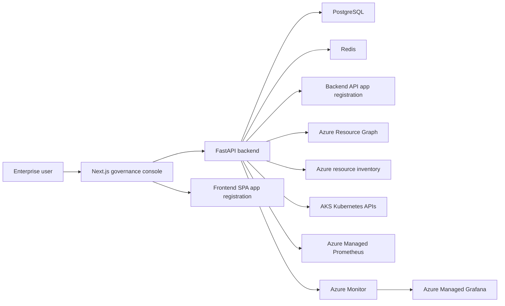
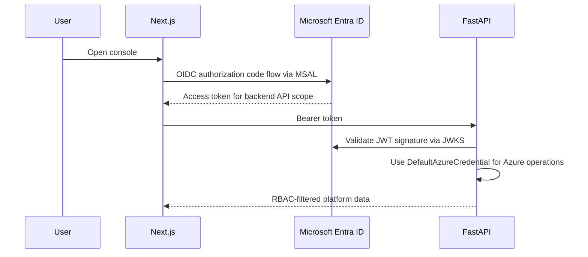

# Architecture

## System Purpose

Sentinel acts as an operational governance and optimization intelligence layer for Azure resource lifecycle management. AKS governance is the first deep integration, but the architecture is intentionally broader: it should analyze resource ownership, lifecycle state, hygiene, utilization, and cleanup readiness across Azure resources as the platform evolves. It consumes Azure APIs, Azure Resource Graph, Kubernetes APIs, Azure Managed Prometheus, and Azure Monitor signals, then produces deterministic, explainable governance findings and resource recommendations.

## High-Level Components

## Backend Boundaries

- API layer owns routing, authentication dependencies, and response contracts.
- Service layer owns Azure, Kubernetes, Prometheus, governance, and optimization logic.
- Persistence layer owns SQLAlchemy models and database sessions.
- Deterministic engines are intentionally isolated to support future AI-assisted analysis without mixing rules and model output.

## Authentication Flow

The frontend and backend use separate app registrations. The frontend app signs in users. The backend app exposes the `access_as_user` scope and is the token audience. Azure Resource Graph, Azure resource discovery, AKS, and Azure Monitor access is performed by the backend using a service-side Azure credential, which is managed identity in the Phase 1 VM runtime.

## Deployment Modes

Mode A deploys the frontend and backend into AKS using Helm, Azure Workload Identity, ACR, Key Vault, Azure Monitor, Managed Prometheus, and Managed Grafana.

Mode B deploys the application surface to Azure Container Apps using the Terraform `container-apps` module foundation. This mode is intended for lower-operational-overhead environments or limited Azure credit demonstrations.

Phase 1 currently uses a VM-hosted public runtime at `sentinel.vaultrix.in` and `api.sentinel.vaultrix.in` so the product can be pitched through real public URLs before Container Apps/App Service work begins.
