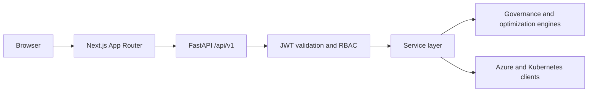
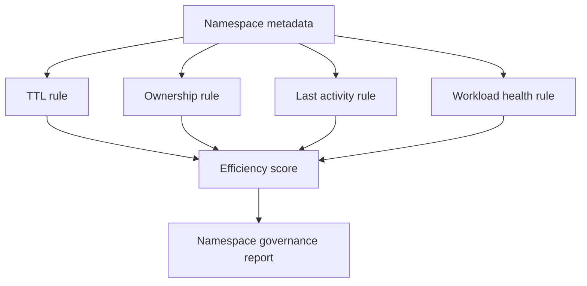
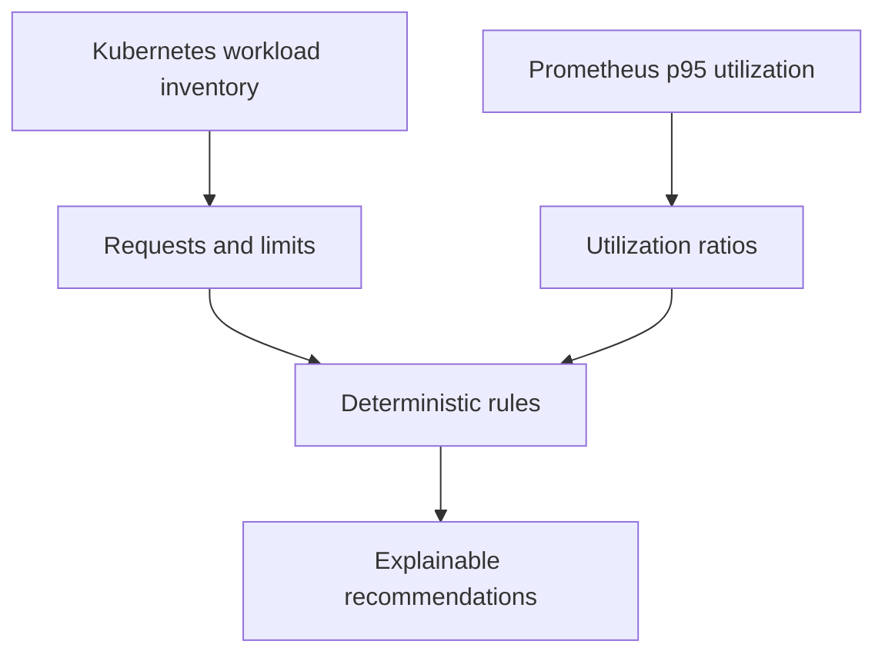

# Diagrams

## Request Path

```mermaid
flowchart LR
  Browser["Browser"] --> Next["Next.js App Router"]
  Next --> FastAPI["FastAPI /api/v1"]
  FastAPI --> Auth["JWT validation and RBAC"]
  Auth --> Services["Service layer"]
  Services --> Engines["Governance and optimization engines"]
  Services --> Azure["Azure and Kubernetes clients"]
```

## Governance Evaluation

```mermaid
flowchart TD
  Namespace["Namespace metadata"] --> TTL["TTL rule"]
  Namespace --> Owner["Ownership rule"]
  Namespace --> Activity["Last activity rule"]
  Namespace --> Workload["Workload health rule"]
  TTL --> Score["Efficiency score"]
  Owner --> Score
  Activity --> Score
  Workload --> Score
  Score --> Report["Namespace governance report"]
```

## Optimization Evaluation

```mermaid
flowchart TD
  Inventory["Kubernetes workload inventory"] --> Requests["Requests and limits"]
  Metrics["Prometheus p95 utilization"] --> Ratio["Utilization ratios"]
  Requests --> Rules["Deterministic rules"]
  Ratio --> Rules
  Rules --> Recommendations["Explainable recommendations"]
```

